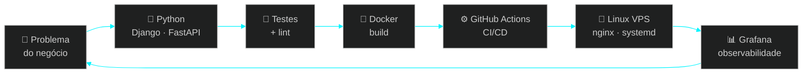

<div align="center">

<!-- ══════════════════════ HEADER NEON ══════════════════════ -->


<!-- ══════════════════════ TYPING SVG ══════════════════════ -->
<a href="https://github.com/ToNiauM">
  
</a>

<br/>

<!-- ══════════════════════ BADGES DE TOPO ══════════════════════ -->


<br/><br/>


<b>&nbsp;Brasília — DF, Brasil&nbsp;</b>


</div>


<!-- ══════════════════════ SOBRE ══════════════════════ -->

##  `whoami`

```bash
$ cat /etc/profile.d/toniaum.sh
```

```yaml
identidade:
  nome:        Toninho Travis
  handle:      ToNiauM
  cargo:       "Supervisor do Setor de Patrimônio — Conselho Federal de Contabilidade (CFC)"
  origem:      Ciências Contábeis  →  apaixonado por Linux & DevOps
  linux_since: "20+ anos de terminal, do dotfile ao cluster"
  foco:        [ DevOps, Cloud, SRE, Data Engineering, IA ]

atualmente:
  estudando:   "MBA em Data Science & Analytics — USP/ESALQ"
  construindo: "Sistemas em Python (Django · FastAPI · Flask) do dev ao deploy"
  filosofia:   "Se eu fiz duas vezes na mão, na terceira vira script."

mindset:
  - "Infra é código. Documentação é entrega. Observabilidade é respeito."
  - "Contabilidade me ensinou a fechar o balanço; DevOps me ensinou a fechar o pipeline."
```

> [!NOTE]
> Migrei da **contabilidade** para a **tecnologia** trazendo comigo o que ninguém ensina em bootcamp:
> rigor com números, obsessão por conciliação e a mania de auditar tudo antes de subir pra produção.
> Hoje isso vira **pipeline verde, log limpo e dashboard que fecha**.


<!-- ══════════════════════ STACK ══════════════════════ -->

##  Arsenal Técnico

<div align="center">

### `> linguagens`


### `> backend & frameworks`


<br/>


### `> devops, cloud & infra`


<br/>


### `> dados, analytics & ia`


<br/>


</div>


<!-- ══════════════════════ PIPELINE MENTAL ══════════════════════ -->

##  Como eu entrego software




<!-- ══════════════════════ STATS ══════════════════════ -->

##  Telemetria do GitHub

<div align="center">


<br/><br/>


<br/><br/>


<br/>


<br/><br/>


</div>

<!-- SNAKE: requer o workflow .github/workflows/snake.yml (incluso neste pacote) -->
<div align="center">

<picture>
  <source media="(prefers-color-scheme: dark)" srcset="https://raw.githubusercontent.com/ToNiauM/ToNiauM/refs/heads/output/github-snake-dark.svg" />
  <source media="(prefers-color-scheme: light)" srcset="https://raw.githubusercontent.com/ToNiauM/ToNiauM/refs/heads/output/github-snake.svg" />
  
</picture>

</div>


<!-- ══════════════════════ PROJETOS ══════════════════════ -->

##  Projetos em Produção

<div align="center">

|  Projeto | Stack | O que resolve |
|:---|:---|:---|
| **PCA — Plano de Contratações Anual** | `Django 5.2` `HTMX` `PostgreSQL` | Acompanhamento do ciclo de contratações públicas do CFC, ponta a ponta |
| **Dashboard People Analytics** | `Flask` `PostgreSQL` `Docker` | Painel público de indicadores agregados de RH |
| **AnaliseDados** | `Grafana` `Flask` `PostgreSQL` | Plataforma de dashboards de dados — `analisedados.online` |
| **Quiz ao Vivo** | `FastAPI` `WebSockets` | Quiz em tempo real estilo Kahoot, multiusuário |
| **Termos de Responsabilidade** | `Flask` `Python` | Geração automatizada de termos por centro de custo |
| **Inventário / Patrimônio** | `Python` `PostgreSQL` | Gestão e documentação operacional do acervo patrimonial |

</div>

<div align="center">
  <a href="https://github.com/ToNiauM?tab=repositories">
    
  </a>
</div>


<!-- ══════════════════════ FORMAÇÃO & CERTS ══════════════════════ -->

##  Formação & Certificações

<div align="center">


<br/>

<br/>


<br/><br/>

<table>
<tr><td><b>MBA · Data Science &amp; Analytics</b></td><td>USP/ESALQ</td><td><code>cursando</code></td></tr>
<tr><td><b>Especialização · Desenvolvimento de Sistemas com Python</b></td><td>Unicesumar</td><td><code>concluído</code></td></tr>
<tr><td><b>Bacharelado · Ciências Contábeis</b></td><td>—</td><td><code>concluído</code></td></tr>
</table>

</div>

### `> roadmap de certificações`

<div align="center">

| Certificação | Emissor | Status |
|:---|:---|:---|
|  **Linux Foundation Certified SysAdmin** | Linux Foundation | `▓▓▓▓▓▓▓░░░` **em preparação** |
|  **GitHub Foundations** | GitHub | `▓▓▓▓▓▓░░░░` **em preparação** |
|  **Certified Kubernetes Administrator** | CNCF | `▓▓▓▓░░░░░░` **estudando** |
|  **AWS Certified (Cloud Practitioner → SAA)** | Amazon Web Services | `▓▓▓░░░░░░░` **planejado** |

</div>


<!-- ══════════════════════ CONTATO ══════════════════════ -->

##  Estabelecer Conexão

<div align="center">

```console
$ ssh contato@toniaum.dev
Bem-vindo. Aberto a oportunidades em DevOps · SRE · Cloud · Data.
```

<a href="mailto:toniaum@gmail.com">
  
</a>
<a href="https://github.com/ToNiauM">
  
</a>
<a href="https://wa.me/5561982098525">
  
</a>
<a href="https://analisedados.online">
  
</a>

<!-- LinkedIn: assim que me passar a URL, descomente a linha abaixo
<a href="https://www.linkedin.com/in/SEU-PERFIL"></a>
-->


<br/><br/>


<i>"Nada é tão automatizado que não possa ser automatizado mais um pouco."</i>

</div>

<br/>


